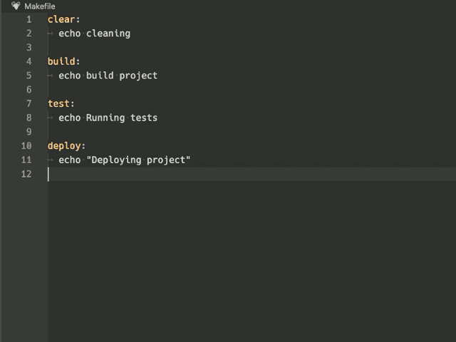
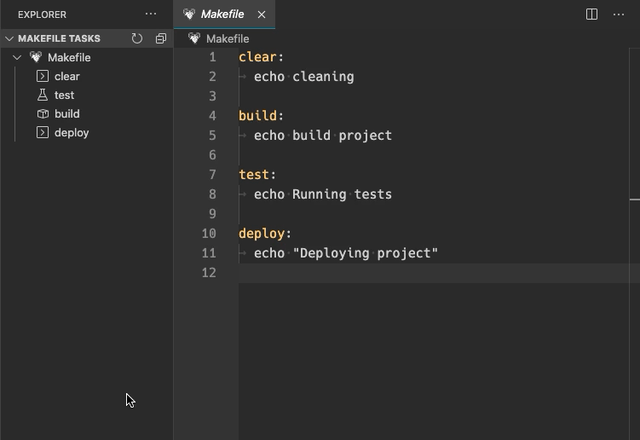

# Make support and task runner

Run `make` tasks and targets from VS Code command picker or via tasks menu.

## Features

- Run `Make` from command picker
  - You can assign a shortcut to the command `make-task-provider.runTarget` and it will list all the available tasks to choose.
- List make as an option from the VS Code task runner menu
  - **Terminal -> Run task**
- Tasks-View listing all available targets
- Multiple workspaces ready!

### Running from the command picker:

### Running from the tasks view:

